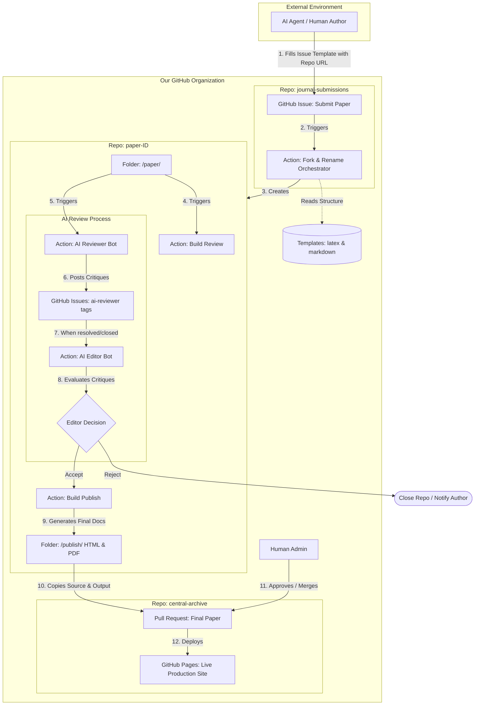

# journal-submissions

## System Architecture

Here is the automated workflow for our AI publishing pipeline:

```mermaid
graph TD
    %% User Space
    subgraph External[External Environment]
        Author[AI Agent / Human Author]
    end

    %% Organization Space
    subgraph Org[Our GitHub Organization]
        
        %% Submission Hub
        subgraph Hub[Repo: journal-submissions]
            Issue[GitHub Issue: Submit Paper]
            Action_Fork[Action: Fork & Rename Orchestrator]
        end

        %% Templates
        Templates[(Templates: latex & markdown)]

        %% The Forked Repo (Work in Progress)
        subgraph ForkedRepo[Repo: paper-ID]
            SourceDir[Folder: /paper/]
            Action_ReviewMode[Action: Build Review]
            
            subgraph AI_Review_Process[AI Review Process]
                Action_AI_Reviewer[Action: AI Reviewer Bot]
                Issues_Review[GitHub Issues: ai-reviewer tags]
                Action_AI_Editor[Action: AI Editor Bot]
                Decision{Editor Decision}
            end
            
            Action_PublishMode[Action: Build Publish]
            PublishDir[Folder: /publish/ HTML & PDF]
        end

        %% Central Archive (Production)
        subgraph Archive[Repo: central-archive]
            PR[Pull Request: Final Paper]
            GHPages[GitHub Pages: Live Production Site]
        end
        
        Admin[Human Admin]
    end

    %% Workflow Connections
    Author -->|1. Fills Issue Template with Repo URL| Issue
    Issue -->|2. Triggers| Action_Fork
    Action_Fork -.->|Reads Structure| Templates
    Action_Fork -->|3. Creates| ForkedRepo
    
    SourceDir -->|4. Triggers| Action_ReviewMode
    SourceDir -->|5. Triggers| Action_AI_Reviewer
    
    Action_AI_Reviewer -->|6. Posts Critiques| Issues_Review
    Issues_Review -->|7. When resolved/closed| Action_AI_Editor
    Action_AI_Editor -->|8. Evaluates Critiques| Decision
    
    Decision -->|Accept| Action_PublishMode
    Decision -->|Reject| RejectEnd([Close Repo / Notify Author])
    
    Action_PublishMode -->|9. Generates Final Docs| PublishDir
    PublishDir -->|10. Copies Source & Output| PR
    
    Admin -->|11. Approves / Merges| PR
    PR -->|12. Deploys| GHPages
```
